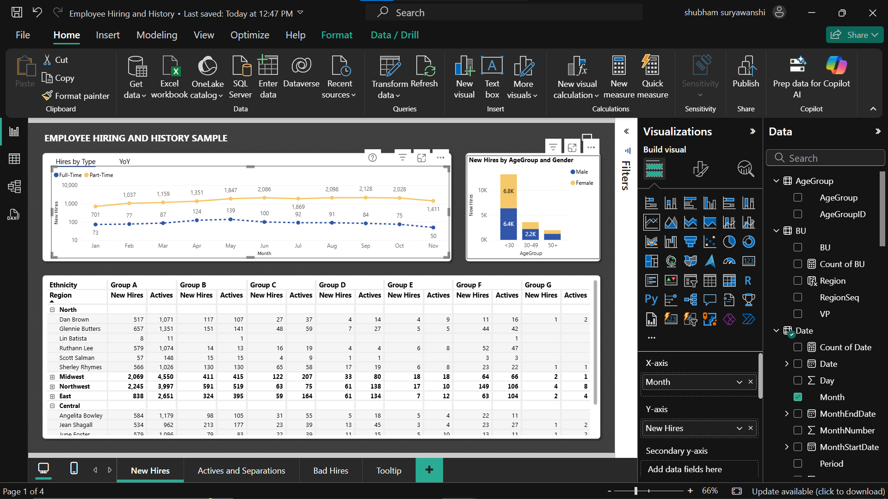

# Employee Hiring and History | Power BI Dashboard

This Power BI project visualizes data related to employee hiring trends and workforce history. It provides key insights into employee demographics, hiring patterns, department-wise distribution, and employment changes over time.

### Dashboard 

## 📊 Key Features

- Year-wise and department-wise employee hiring trends
- Visualization of employee count by department and designation
- Gender distribution and diversity metrics
- Resignation and employee turnover patterns
- Dynamic filters for better interactivity

## 🛠 Tools & Technologies

- Power BI Desktop
- Data Modeling & DAX
- Data Visualization & Reporting

## 📁 File Included

- `Employee Hiring and History.pbix` – Power BI project file

## 🚀 How to Use

1. Download the `.pbix` file from this repository.
2. Open it using Power BI Desktop.
3. Explore interactive dashboards and filters.
## 📷 Dashboard Preview

### 🔹 Overall Dashboard View

